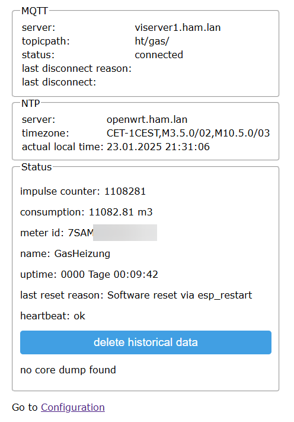

# Make your gas/water meter smart
Forecasting the whole gas and water costs is actually much more interessting than some years ago. To do so it is neccessary to have smartmeters installed by your utility company. If this is not the case like in my home it is common that most meters provides an impulse simply by integrated a magnet. This magnet can be used to record the consumption by counting the impulses.

There are some projects included tasmota that provided impulse counters but I decided to create my own specialzed to my purposes included a WebUI, Watchdog and value calculation.

## Featurelist
* MQTT integration
* value calculation from impulses
* Realtime clock for logging and end of month history
* Guided setup to avoid storing WiFi password, etc. in the code
* NVRAM backup
* watchdog to monitor if the device was offline longer than 10 minutes
* build in LED shows reed sensor status

## [Hardware](docs/schema.pdf)
* MH-ET Live D1 mini ESP32 (Most other ESP32 dev boards are supported as the GPIOs can be set in the software. 4Mbit NVRAM at least is neccessary.)
* STL for [case (thingiverse)](https://www.thingiverse.com/thing:4871082)
* Reedsensor has to be connected to ground and GPIO 27 (can be changed in the constants, every digital GPIO can be used)
* [sensor case for Pietro Florentini/Samgas meters](docs/Gaszaehler_Halter.stl)

## Mounting
The reed sensor has to be mounted near to the magnet. For Pietro Florentini/Samgas meters I included a STL to mount the reed sensor. It has to be placed near to the outer wall of the mechanical counter, below the lowest red number.

# Software
On first boot the thing opens an Access Point named "Gaszaehler" to provide the setup interface. The interface is still available after the device is connected so you can change everything later. 
You can compile your own firmware version or use the firmware provided in the releases section.

The precompiled firmware is compatible with most ESP32 boards as the GPIOs could be set during configuration. To upload it you can use esptool.py or [ESP32 Download Tool](https://www.espressif.com/en/support/download/other-tools) provided by espressif. 

This is an example for esptool, the settings can be copied also to the ESP32 Download Tool as it is simply a GUI to flash an ESP32. COM6 has to be changed accordingly to the device serial port.

"python.exe" "esptool.py" --chip esp32 --port "COM6" --baud 460800 --before default_reset --after hard_reset write_flash -z --flash_mode dio --flash_freq 40m --flash_size 4MB 0x1000 bootloader.bin 0x8000 partitions.bin 0xe000 boot_app0.bin 0x10000 firmware.bin

## Setup
1. Do the system configuration and set things name (hostname), AP password (if WiFi connection is lost) and WiFi credentials for your network.
2. MQTT configuration (optional) - SSL/TLS Support will be added on request, actually not supported.
   1. publishes the topics (topicpath as prefix):
      * "meters/meter id": actual data for the meter
      * "historic": historical data - end of month for all meters (actually only one meter is supported)
      * "status": On-/Offline status of the system
      * "log/info": some status text
      * "log/sysinfo": system information like heartbeat, last reset reason or MQTT disconnect reason which can be used for device monitoring
      * "log/wifi": status of the WiFi connection with SSID, IP, MAC and RSSI
   2. subscribes to topic:
      * "command/set_impulse": sets the actual impulse count and resets the watchdog like it can be done also from WebGUI (e.g. after a power outage longer than 10 minutes)
3. NTP configuration to get RTC infos for logging (default is fine for german timezone)

## MQTT JSON content in detail

TODO

### Publications

TODO

### Subscribtions
command/set_impulse: {id: meter id, impulse: impulse as int}

